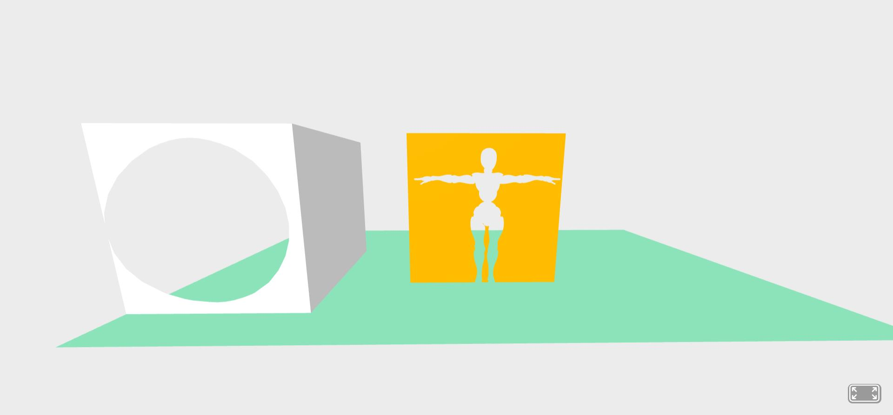

# A-Frame-Occlusion-Component


### **Description / Rationale**
This is the A-Frame component, which lets achieve occlusion effects.     

### **Instructions**
The component has the following attributes:
* occlusionModelUrl: { type: 'string' } - url to a gltf model, which will serve as occlusion model.
* occlusionModelPosition: { type: 'vec3', default: { x: 0, y: 0, z: -3 } } - occlusion model position.
* occlusionModelRotation: { type: 'vec3', default: { x: 0, y: 0, z: 0 } } - occlusion model rotation.
* occlusionModelScale: { type: 'vec3', default: { x: 1, y: 1, z: 1 } } - occlusion model scale.
* occlusionModelPart: { type: 'boolean', default: false } - indicate if specific part/s of the occlusion model will serve for occlusion (i.e. whether only part/s of the model should serve for occlusion). 
* partNames: { type: 'array'} - if occlusionModelPart is true, then include the names of the parts of occlusion model, which will serve for occlusion.
* occludedModelUrl: { type: 'string' } - url to gltf model which will be occluded by occlusion model.
* occludedModelPosition: { type: 'vec3', default: { x: 0, y: 0, z: -4 } } - occluded model position. 
* occludedModelRotation: { type: 'vec3', default: { x: 0, y: 0, z: 0 } } - occluded model rotation.
* occludedModelScale: { type: 'vec3', default: { x: 1, y: 1, z: 1 } } - occluded model scale.
To see component at work, include "occlusion-component" to a-entity. Below a simple implementation of the component is given: 
```
<html>
<head>
    <script src='https://aframe.io/releases/1.4.0/aframe.min.js'></script>
    <script src='js/occlusion-component.js'></script>
</head>
<body>
    <a-scene>
        <a-entity occlusion-component="occlusionModelUrl: 3d/xbot.glb;
                                      occludedModelUrl: 3d/plane.glb;
                                      occlusionModelPosition: 0 0 -3;
                                      occlusionModelRotation: 0 0 0;
                                      occlusionModelScale: 1 1 1;
                                      occlusionModelPart: true;
                                      partNames: Beta_Surface; 
                                      occludedModelPosition: 0 1 -3.2;
                                      occludedModelRotation: 0 0 0;
                                      occludedModelScale: 2 2 2;"></a-entity>
        <a-entity occlusion-component="occlusionModelUrl: 3d/sphere.glb;
                                      occludedModelUrl: 3d/box.glb;
                                      occlusionModelPosition: -3 1 -3;
                                      occlusionModelRotation: 0 0 0;
                                      occlusionModelScale: 1 1 1;
                                      occlusionModelPart: false;
                                      occludedModelPosition: -3 1 -3.5;
                                      occludedModelRotation: 0 0 0;
                                      occludedModelScale: 2 2 2;"></a-entity>
        <a-plane position="0 0 -4" rotation="-90 0 0" width="8" height="4" color="#7BC8A4"></a-plane>
        <a-sky color='#ECECEC'></a-sky>
    </a-scene>
</body>
</html>
```

### **Tech Stack**
The project is powered by AFrame and Three.js

### **Demo**
To see the application at work: [Demo application](https://gltfanimations-runtime.glitch.me/)
